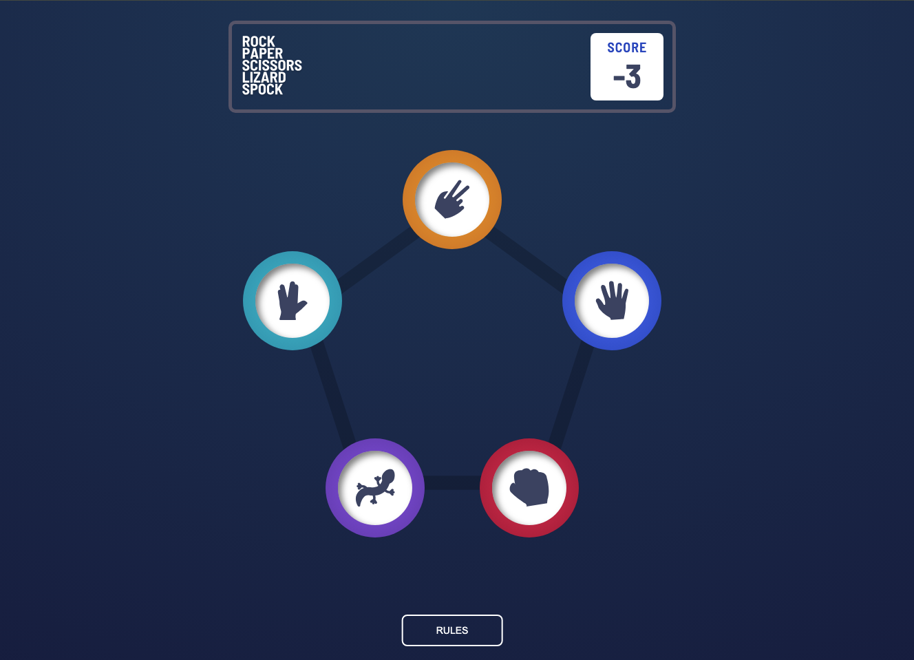
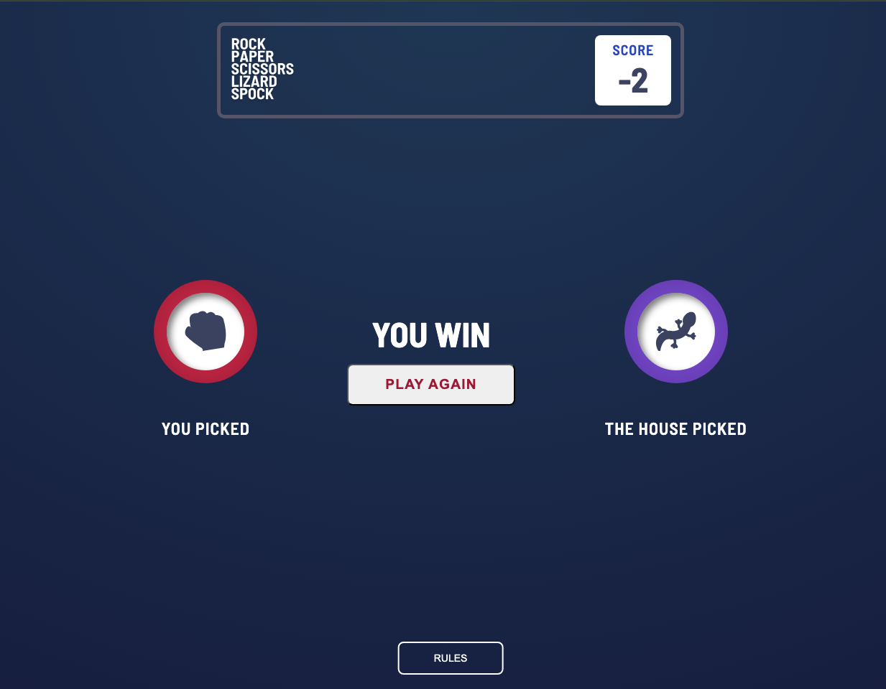

# Frontend Mentor - Rock, Paper, Scissors solution

This is a solution to the [Rock, Paper, Scissors challenge on Frontend Mentor](https://www.frontendmentor.io/challenges/rock-paper-scissors-game-pTgwgvgH).

## Table of contents

- [Frontend Mentor - Rock, Paper, Scissors solution](#frontend-mentor---rock-paper-scissors-solution)
  - [Table of contents](#table-of-contents)
  - [Overview](#overview)
    - [The challenge](#the-challenge)
    - [Screenshot](#screenshot)
    - [Links](#links)
  - [My process](#my-process)
    - [Built with](#built-with)
    - [What I learned](#what-i-learned)
    - [Continued development](#continued-development)
  - [Author](#author)

## Overview

### The challenge

Users should be able to:

- View the optimal layout for the game depending on their device's screen size ✅
- **Play Rock, Paper, Scissors, Lizard, Spock** against the computer ✅
- Maintain the state of the score after refreshing the browser. ✅

### Screenshot

### Links

- Solution URL: [Add solution URL here](https://your-solution-url.com)
- [Live Site URL](https://bigbangbattle.netlify.app/)
- [GitHub URL](https://github.com/prabhashranjaner/Rock_Paper_Scissors_Spock)

## My process

### Built with

- Semantic HTML5 markup
- CSS custom properties
- Flexbox
- CSS Grid
- Mobile-first workflow
- Typescript
- ContextAPI \_ useReducer
- [React](https://reactjs.org/) - JS library
- [Styled Components](https://styled-components.com/) - For styles

### What I learned

- At first I had done Rock-Paper-Scissors, but wanted to give some challange so i went for bonus challange.
- It was not that hard to extent the logic.
- Right now logic is kind of simple but will think of better way and update the logic in future.
- Used **ContextAPI** with **useReducer** which made component clean and short.

### Continued development

- I will look t develop game with more complex logic.

## Author

<!-- - Website - [Add your name here](https://www.your-site.com) -->

- Frontend Mentor - [@prabhashranjaner](https://www.frontendmentor.io/profile/prabhashranjaner)
- X - [@prabhashranjaner](https://x.com/prabhash__dev)
